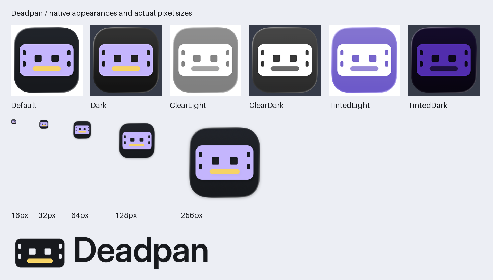

# Deadpan identity

The mark is an expressionless film frame. Two square eyes sit above a straight
yellow bar, connecting the name to a held moment on the edit. The lavender and
yellow match the workspace's existing selection and cursor colors.



## Artwork and formats

| Asset | Purpose |
| --- | --- |
| [Editable macOS icon](../../../assets/brand/macos/Deadpan.icon) | Real Icon Composer document, separate vector frame and mouth, system-owned enclosure and background material. |
| [ICNS](../../../assets/brand/macos/Deadpan.icns) and [iconset](../../../assets/brand/macos/Deadpan.iconset) | Complete 16, 32, 128, 256, and 512 point sizes at 1x and 2x, up to 1024 px. |
| [1024 px PNG](../../../assets/brand/app-icon-1024.png) | Flattened native app icon for general use. |
| [256 px runtime PNG](../../../assets/brand/app-icon-256.png) | Apple's legacy 128 point @2x rendering for bare executable launches. |
| [Logo exports](../../../assets/brand/logo) | Transparent mark, outlined wordmark, and horizontal lockup in SVG, PNG, and vector PDF. Color, on-light, on-dark, mono-black, and mono-white variants. |
| [Web exports](../../../assets/brand/web) | Vector favicon, seven-resolution ICO, PNGs at 16/32/48/192/512 px, and an opaque 180 px Apple touch icon. These are reusable assets; no website is added. |
| [Native appearance previews](../../../assets/brand/macos/appearances) | 1024 px Default, Dark, ClearLight, ClearDark, TintedLight, and TintedDark renders. |

Use the colored mark on quiet backgrounds. Use `on-light` for the strongest
contrast on light surfaces, and `on-dark` for dark surfaces. Monochrome versions
cut the mouth out of the frame so the expression survives one-color printing.
Keep clear space of at least one eye width around the mark. Do not stretch it,
rotate it, change the expression, or add the wordmark inside the app icon.

The wordmark is Inter SemiBold, optical size 32, with outlined glyphs. SVGs and
PDFs have real vector paths, no embedded raster artwork, live text, or font
dependency. The unmodified Inter variable font and its SIL Open Font License
are retained under [source](../../../assets/brand/source) for reproduction.
That font is a design input; the developer app bundle does not include it.

## ImageGen provenance

The built-in `image_gen.imagegen` tool generated these references on 2026-09-30.
The tool returned no model identifier. Exact prompts and original image bytes
are retained in this repository:

1. [Concept sheet](generated/01-concepts.png), [prompt](prompts/01-concepts.txt).
   The leftmost concept was selected. Its frame connects to video and its dry
   expression fits the name without adding a character to the workspace.
2. [Selected icon master](generated/02-icon-master.png),
   [prompt](prompts/02-icon-master.txt). This simplified the film perforations.
3. [Flat adaptation reference](generated/03-flat-mark-reference.png),
   [prompt](prompts/03-flat-mark.txt). Its alpha edges contain visible artifacts,
   so those pixels are retained as a reference only.

The production vector layers are an optically regularized reconstruction of the
selected generated design. This is a genuine path-based adaptation, not a raster
image wrapped in SVG. Apple renders the final icon material and enclosure from
those layers. The original ImageGen shading is preserved in the generated master
and is not baked into the Icon Composer foreground layers.

## Current macOS treatment

Apple's current workflow uses a layered `.icon`, 1024 px artwork, system masking,
and default/dark/mono appearances. Foreground artwork omits baked shadows and
backgrounds; Icon Composer owns those effects. See
[Creating your app icon using Icon Composer](https://developer.apple.com/documentation/xcode/creating-your-app-icon-using-icon-composer)
and [Icon Composer](https://developer.apple.com/icon-composer/).

The document structure was checked against Apple's
[Landmarks sample](https://developer.apple.com/documentation/swiftui/landmarks-building-an-app-with-liquid-glass)
([download used](https://docs-assets.developer.apple.com/published/a88428e6793e/LandmarksBuildingAnAppWithLiquidGlass.zip)).
Only the format was consulted; no Apple artwork is included. In this installed
format, the mono specialization is named `tinted`. The mouth has a darker tone
than the white frame in mono mode. The frame and mouth remain separate editable
layers. Their restrained material avoids a heavy highlight around every hole.

The deployment baseline remains macOS 15.0. Layered icons on newer macOS and
complete ICNS fallback assets coexist; branding does not raise the app baseline.

## Rebuild exports

Requirements: macOS, configured Xcode, `uv`, and `rsvg-convert` (librsvg).

```sh
uv run tools/brand/export.py
```

The script pins Pillow 11.3.0 and fontTools 4.59.0. It compiles and inspects the
catalog, renders six appearances, extracts all ten iconset entries, rebuilds
ICNS, produces vector/raster logos and web formats, and writes the contact sheet
and [manifest](manifest.json). Source artwork and prompts remain unchanged.
The manifest records byte hashes, dimensions, actual compiler versions, and
the retained font identity. Compiler reports can contain run-specific IDs;
reproduction means the same artwork and formats with the recorded toolchain,
not a promise of identical catalog container bytes across Xcode versions.

The font is Inter version `4.001;git-66647c0bb`, downloaded from
[Google Fonts' Inter source](https://github.com/google/fonts/tree/main/ofl/inter).
Its retained SHA-256 is
`29160a80ff49ddcab2c97711247e08b1fab27a484a329ce8b813d820dc559031`.

## Developer app bundle

Build the executable using the project's normal locked Cargo instructions, then:

```sh
python3 tools/build-app.py \
  --binary target/debug/deadpan-app \
  --output /tmp/Deadpan.app
```

The output must be a new `.app` path. This wrapper consumes the supplied binary;
it does not run Cargo. It compiles `Deadpan.icon`, verifies actual layered
catalog records, installs `Assets.car` and a complete `Deadpan.icns`, and writes
`CFBundleIconName=Deadpan` / `CFBundleIconFile=Deadpan.icns` in `Info.plist`.
The native host preserves a declared bundle icon and uses the 256 px PNG for
bare executable launches. The bundle records its external library dependencies
in `Contents/Resources/developer-build.json`.

This is a local developer wrapper. Pinned FFmpeg libraries remain external;
signing, notarization, relocation, clean-machine installation, and release
qualification remain open.

## Verification on 2026-09-30

The [format audit](validation.json) records the exact checked inventory and
expected failure results. [Integration evidence](../../../tools/media-qualification/evidence/2026-09-30-brand/README.md)
retains native checks, PDF render review and the final code gate.

- macOS 26.5.2, Xcode 26.6 (17F113), Icon Composer 1.6 (99.1).
- A fresh `actool` compilation produced `Assets.car`; `assetutil` confirmed the
  two vector sources and `IconImageStack` entries for Aqua, DarkAqua, and
  Tintable. See [retained catalog inspection](compiled-assets.json).
- `iconutil` extracted and repackaged all ten standard slots. Every PNG has the
  expected dimensions and eight-bit RGBA format. ICNS was decoded again after
  packaging. All six appearance renders and the contact sheet were inspected.
- The SVG/PDF logos contain outlined geometry. Their PNG exports preserve
  alpha. The ICO contains 16, 24, 32, 48, 64, 128, and 256 px entries.
- The wrapper produced a real local bundle from an existing Deadpan executable.
  An existing output path and a nonexecutable input were rejected. The
  integration owner also verified bare and bundled Metal startup/shutdown and
  the icon returned by AppKit for the bundle.
- All 2,572 locked workspace tests and 338 UI-feature tests passed, with no
  failures or ignored tests. Strict workspace/UI Clippy and formatting passed.
  A separate integration review found no issues in bundle-icon preservation or
  the embedded fallback. All 15 PDF exports were rendered and visually checked;
  none contained embedded fonts or raster images.

Initial tool failures are resolved: the system `ictool` shim and `actool`
reported unfinished Xcode plugin setup. `xcodebuild -runFirstLaunch` completed
successfully; the exporter resolves Icon Composer's bundled `ictool` through
PATH. An initial layer order hid the mouth and an unsupported `mono` annotation
failed parsing; the final document uses the inspected front-to-back order and
the accepted `tinted` annotation. These checks establish branding integration,
not the full product's release readiness.
