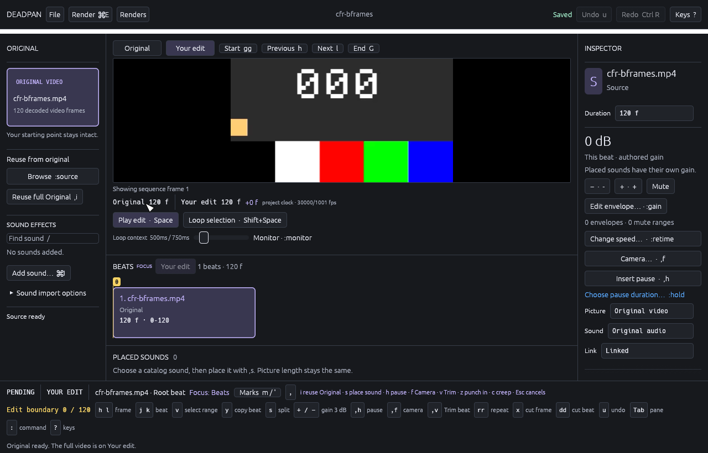
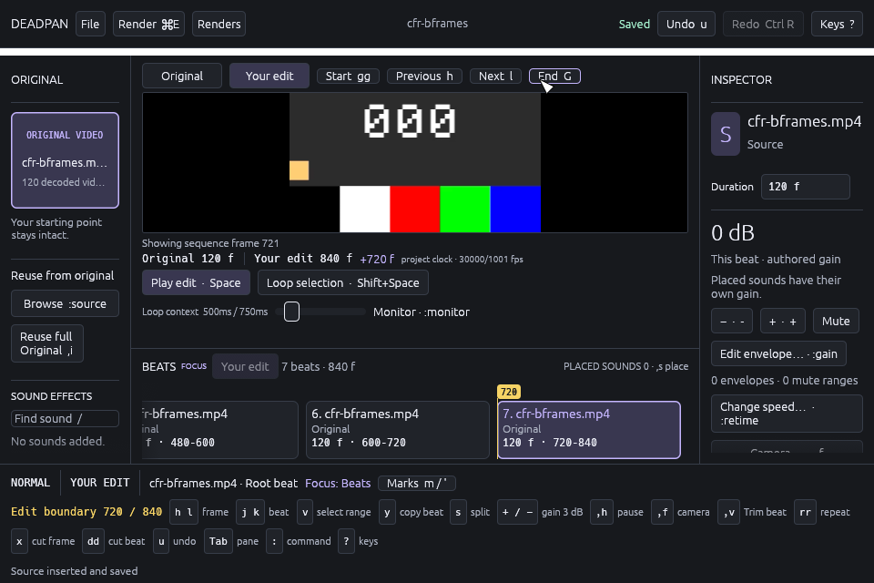

# Declarative editor bindings, 2026-10-01

Normal and timeline Visual commands now compile from one bounded declarative
map. Prefix guidance and held-key eligibility use those same rules. This fixes
an accidental edit: holding H before pressing comma could complete `,h` and
insert a Hold. Pending paths now require explicit key presses.

This increment starts at `b6bf7879384be9c740cdb7ccc39c813ebd6784ac`.
Core schema 43 and database 52 are unchanged. User keymap loading, the remaining
mode maps, named registers, semantic dot-repeat and macros remain required.
All product requirements and Gates A through G remain open or partial. See
[the binding contract](../KEYMAP.md) and
[retained evidence](../../tools/media-qualification/evidence/2026-10-01-declarative-bindings/README.md).

## Verification

The full base workspace gate passed 3,450 unit/integration tests and both
documentation tests, with none ignored. Formatting, workspace/all-target Clippy
and app-feature/all-target Clippy also passed with warnings denied.

After clearing the app artifacts, the base app suite passed 532 app tests and
three headless tests; the `ui-harness` suite passed 568 app tests and the same
three headless tests. These overlapping suites must not be added together.
The rebuilt debug `editing` replay passed all 40 checks, plus the separate
26,536-case Kestrel audit against 62 reservations with no live-source drift.
Its executed binary SHA-256 was
`ad68b406b105ecfefddd1cfdc5597ce2af361a324364c15325f730afeebaa2ee`.

The full release visual replay then passed all 23 ordinary scenarios: 3,018
checks plus the same separate Kestrel audit. This includes 819 Place slice,
308 range-delete, 155 mark and 164 Trim checks. The generated-picture scenario
was explicitly skipped because no real accepted-bundle fixture was supplied.
The release binary SHA-256 was
`2a9b83bca8d0abe85cfcff7bfc4983bcadc212c2f4b711ee26e4f6b9720f64d0`.
Each report preserves its exact scenario limits, injected delivery events and
unmeasured native behavior. The full log also retains the decoder diagnostics
emitted during Place slice; all of that scenario's assertions passed.

All final checks use source inventory
`f7c76db5de09d55ee4da19aa764cb94966a77ebade397e896c1c690a23c8428c`.
Each command records its source inventory before and after execution.
The retained logs include the existing nonfatal linker warning that `__eh_frame`
exceeds the compact unwind table's 16 MB limit. No warning suppression or
performance qualification is claimed.

The first intended current-source replay actually executed the old-source
binary: its SHA-256 exactly matched the red witness, it still reported the old
18,352-case audit, and the new count-hint literal was absent. The isolated
comparison had shared Cargo's target directory. A fresh source fingerprint did
not restore the top-level executable that the other build had overwritten.
That failed report is retained as an artifact-identity failure, not evidence
about current-source behavior. App development artifacts were cleared before
rebuilding both app suites and verifying the replacement executable's identity.
Future archived comparisons must use separate target directories.

The root agent inspected the retained comma-prefix image at 1280×820 and the
workspace at 960×640. The pending key and complete continuation guidance remain
visible after held input; the minimum-size footer wraps without covering the
picture or timeline.

## Regression and review

The same new production replay was applied to an isolated archive of the base
commit. That old-source run failed exactly one assertion:

`Repeated H leaves the document, history and comma prefix intact`

The archive, patch and unchanged source inventory identify the old build
independently of Git metadata. Its binary SHA-256 was
`107ade3406a8773fce891b35bb4545cfe1474f34866b140e11735b3770368b41`.
The shared checkout was never replaced to obtain this witness.

The replay holds H at Edit 0, presses comma, then delivers three synthetic held
H events. It checks the complete document, history, both cursors, selected
beat, idle writer and pending comma. It also checks the actual painted guidance.
Releasing H and pressing it again must insert exactly one silent half-second
Hold. One Undo must restore every authored field apart from the fresh revision.

Independent review caught an audit gap: the first implementation enumerated only
annotated branches. The corrected audit walks every structural branch, and a
test covers an unannotated intermediate node. Final independent static review
found no actionable issue in the compiler, routing, count policy, native-control
ownership, semantic capture transitions or new regressions.

## Development dependency repair

The retained temporary FFmpeg prefix lacked required headers. The first check
also omitted `DEADPAN_FFMPEG_PREFIX`; with it supplied, compilation exposed the
missing headers. Initial recovery then exposed missing generated `avconfig.h`
and public `display.h`. These were setup failures, not passing code checks.

Headers were restored from the existing pinned FFmpeg 8.0.3 archive, SHA-256
`6136812ea6d4e68bdba27e33c2a94382711cdf4f8602ffef056ff792bd6f9818`.
Configure used the retained binary's exact flags to reconstruct `avconfig.h`;
`make install-headers` supplied the remaining public headers. Existing header
bytes did not change. Recorded hashes confirm the runtime binaries and dynamic
libraries did not change. This repairs developer setup and makes no packaging
qualification claim.

## Limits

The replays use the production project service, SQLite, qualified source
receipts, FFmpeg decoder and offscreen Metal renderer on an Apple M5 Max with
macOS 26.5.2 and Rust 1.97.1. The fixture is `cfr-bframes.mp4`, SHA-256
`5a820a79bf550d484d8ecb37ffddd048d0636794ebce5db83e4f5ce5f5e64918`.
They script picker results and synthesize input. They do not establish physical
keyboard or non-US layout behavior, OS IME delivery, VoiceOver, physical display
color, audio device/acoustic behavior or release readiness.

No ordinary native window was opened for this increment. All short-lived replay
processes exited; the test application remains closed between runs.
