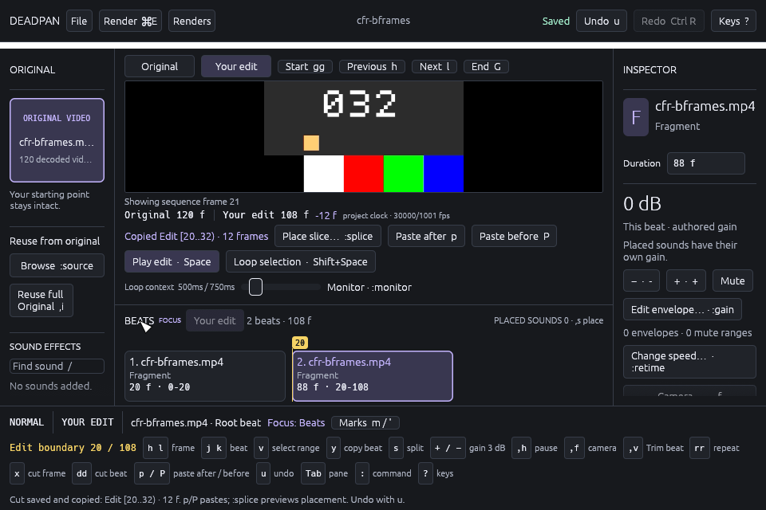

# Native frame cuts, 2026-10-01

`x`, counted `12x` and captured `:delete-frames Nf` now cut linked picture and
sound frames at the retained Edit cursor in an ordinary Sequence. The interval
stops only at that group's end. One saved cut supplies the historical copy and
one Undo restores the removed content. See the [frame-cut contract](../EDITED_SLICES.md#frame-cuts-at-the-cursor).

This increment starts at `bde973ad611b8cf1bdcbcc65783e1019a5ec315e`.
Core schema 43 and database 52 are unchanged. All product requirements and
Gates A through G remain open or partial. The [retained evidence](../../tools/media-qualification/evidence/2026-10-01-native-frame-cuts/README.md)
includes exact commands, source inventories, failures, full replay reports
and the inspected rendered images.

## Verification

These overlapping checks are reported separately; their counts must not be added.

| Scope | Result |
| --- | --- |
| Base workspace tests, before review corrections | 3,424 unit/integration tests and both documentation tests passed; none ignored. |
| Base workspace/all-target Clippy | Passed with warnings denied. |
| Final base app suite | 506 app tests and 3 headless tests passed. |
| Final app suite with `ui-harness` | 542 app tests and 3 headless tests passed. |
| Final formatting and app-feature/all-target Clippy | Passed with warnings denied. |
| Final rendered `delete-range` replay | 308 checks passed. |
| Final rendered `workspace` replay | 80 checks passed. |
| Final rendered `marks` replay | 155 checks passed. |
| Live Kestrel compatibility in each replay | 18,352 routing cases across 62 reservations passed without source drift. |

The broad workspace gate used source inventory
`d370c6e80bc397d7b5e3a215a392fed15f838b10029a6e9f2c62d9e57dd1a408`.
All final checks used the same unchanged source inventory:
`f4b664d41ab7e41c7b36c8466c376cd6b989abe9590a42f49a0123428662e3c0`.
The app input guards and replay coverage changed after the broad gate. The
full workspace was not rerun after those corrections; both final app suites,
feature lint and the three rendered regressions cover the corrected files.

Each command records its source inventory before and after execution. The
replay summary links each full report to its command record, source inventory
and executed binary hash. All final replays used the same debug binary. Retained
logs include the nonfatal linker warning that `__eh_frame` exceeds the compact
unwind table's 16 MB limit. No warning suppression or performance claim is made.

## Review and corrections

Independent implementation and replay review checked entry-time eligibility,
exact scope and revision, register intent, modal ownership and native focus.
Final independent code review found no actionable issue.

The first failing replay reproduced a register race: refused Visual `x` left an
older successful yank pending. The corrected router emits a typed frame-cut
intent so register supersession happens before target refusal. The final witness
holds an actual successful copy response for the exact historical revision and
range, issues the refused cut, then releases that same response. It cannot
replace the previously accepted copy or edit history.

Review also corrected bare `x` routing through focused native controls and a
same-batch Open dialog. A second failing replay then showed that the new focus
guard intercepted `x` as a pending mark name. The corrected guard reserves only
bare, unmodified `x`; final checks save `mx`, jump with `'x` from Edit 30 to 20,
and Undo the mark while preserving the copy and edit history. Sources focus
also hides the frame-cut footer hint.

The original failed reports are retained as `register-red` and `mark-red`.
Their exact failed assertions were respectively:

- `Refused Visual x immediately supersedes the older pending yank`
- `Focused native control routes x as the pending mark name`

## Observed behavior and layout

The replay checks `x`, same-batch `12x` and `:delete-frames 12f`, exact historical
ranges, one saved command and complete restoration through one Undo. After
cutting Edit `[20,32)`, the decoded picture at Edit 20 is Original 32 and the
preceding picture remains Original 19. The copy remains available after Undo.

In a nested ordinary group `[20,80)`, `12x` at 75 cuts only `[75,80)` and leaves
the root suffix beginning at Original 80. Partial Repeat and Retime endpoints
reject the entire requested interval. Active/finished and empty/nonempty Visual
selections, zero/overflow/terminal targets, Original, Sources and Placed sounds
cannot become frame cuts. Real concurrent Undo invalidates captured revision;
a delayed Split cannot supply eligibility absent at command entry. Held keys,
modifiers, synthetic text/IME, focused controls and newly opened Help/Open
modals retain their input ownership.

At 960×640, checks inspect actual painted text clips. The root agent also
inspected both retained images: the exact cut receipt and historical copy are
readable, the `x` hint fits, and the footer does not overlap the picture.

## Limits

These debug replays use the production project service, SQLite, qualified
source receipts, FFmpeg decoder and Metal rendering on an Apple M5 Max with
macOS 26.5.2 and Rust 1.97.1. The fixture is `cfr-bframes.mp4`, SHA-256
`5a820a79bf550d484d8ecb37ffddd048d0636794ebce5db83e4f5ce5f5e64918`.
They script picker results and synthesize input. They do not establish physical
keyboard or non-US layout behavior, OS IME, VoiceOver, physical display color,
audio device/acoustic behavior, large-project performance or release readiness.

No ordinary native window was opened for this increment. All short-lived
replay processes exited; the test application remains closed between runs.
The full editing grammar and arbitrary nested occurrence cuts remain required.
